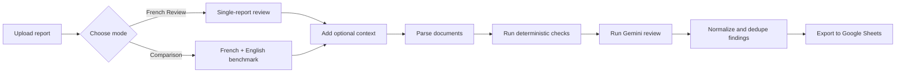
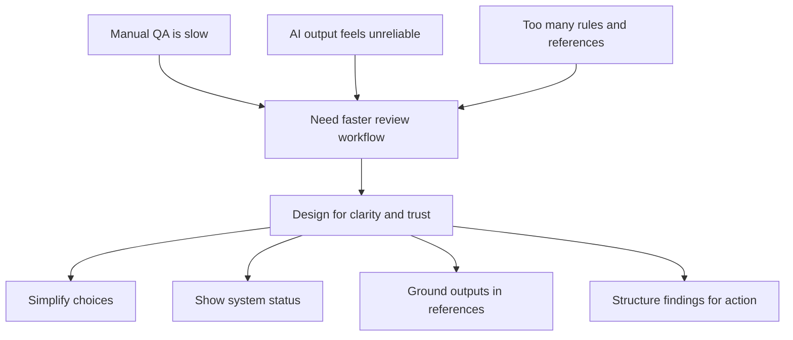
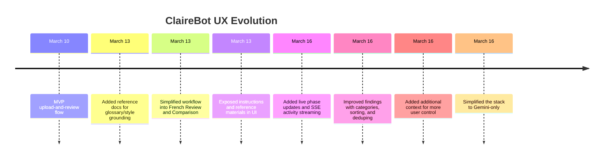
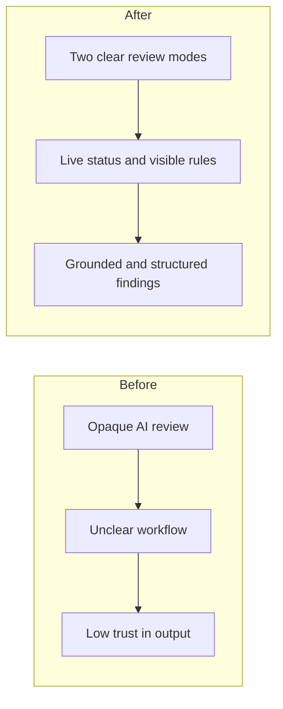

# ClaireBot UX Case Study

## 1. Overview
ClaireBot is an AI-assisted QA tool for MTM/OTM reports. The UX challenge was not only to generate review findings, but to make a complex AI workflow feel clear, trustworthy, and usable for editorial teams.

## 2. Problem
Reviewers needed to check French reports for terminology, structure, methodology, and data consistency, sometimes against an English benchmark. Manual review was slow and repetitive. A raw AI workflow reduced effort, but introduced a new problem: the process felt opaque, noisy, and hard to trust.

## 3. Goal
Design a review experience that:

- reduces manual QA effort
- makes the AI workflow understandable
- gives users more control over the review context
- returns findings in a structured, operational format

## 4. Role
I shaped the end-to-end product experience, including:

- upload flow
- review-mode selection
- instruction and prompt visibility
- reference-document integration
- live processing feedback
- structured findings output

## 5. Process

### Product Flow

### UX Problem Framing

### Iteration Timeline

## 6. Key Design Decisions

### 1. Reduce setup complexity
Instead of asking users to configure multiple ambiguous options, the workflow was reduced to two clear modes:

- `French Review`
- `Comparison`

This made the product easier to understand and reduced setup friction.

### 2. Make the AI visible
One of the biggest UX issues with AI tools is that users do not know what the system is doing. To address this, the product introduced:

- phase-by-phase activity logging
- real-time streaming updates
- visible instructions and active references

This shifted the experience from a black box to a guided process.

### 3. Ground the model in reference standards
The tool was extended to load glossary and style-guide documents so the AI was not operating only from prompts. This improved alignment with the team’s existing editorial standards and made the output feel more credible.

### 4. Make results operational
The final output was shaped into structured findings that are:

- categorized
- sorted
- deduplicated
- exportable to Google Sheets

This made the tool fit into an actual QA workflow instead of ending as a generic AI response.

## 7. Before vs After

## 8. Outcome
The final experience is a review dashboard where users can upload reports, choose a clear workflow, add contextual guidance, follow the process in real time, and receive structured findings in a sheet-ready format. The product became less like an experimental AI wrapper and more like a usable internal operations tool.

## 9. Learnings

- In AI products, trust is a UX problem as much as a model problem.
- Simplifying choices improved usability more than adding flexibility.
- Visibility into system behavior made the tool feel more reliable.
- Better output structure was as important as better model quality.
- Reference grounding helped bridge the gap between AI behavior and domain expectations.

## 10. Tools For Visuals
If you want to keep building diagrams from this case study, these are the most practical options:

- Mermaid: best if you want diagrams stored as text and versioned with the repo.
- Mermaid Chart: useful if you want AI-assisted editing and presentation-friendly diagram cleanup.
- Figma plugin `Mermaid in Figma`: useful for importing Mermaid diagrams directly into Figma.
- draw.io: useful if your team wants manual diagram editing and quick exports.
